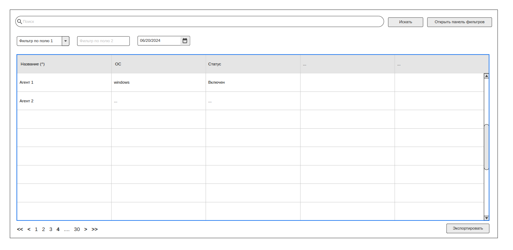

# PT START. Задание

Доступен сервис (ApiService), эмулирующий API агентов, дающий возможность запрашивать постранично данные, фильтровать и сортировать их. 

## Обязательное задание
1. Необходимо написать компонент грида со следующим функционалом:
* программное указание набора входных данных (массив с полями типа string, number, boolean, string[]);
* программное указание конфигурации колонок (выбор отображаемых колонок, доступность сортировки и фильтрации для каждой колонки);
* фильтрация данных по конкретной колонке;
* фильтрация данных поиском по всем колонкам одновременно (полнотекстовый поиск простым вхождением текста без учета регистра);
* сортировать колонки;
* отображение только части необходимых данных (один из вариантов ниже, если не будете делать виртуальный скролл)
  * пагинация
  * подзагрузка при скролле.

2. Использовать реализованный компонент грида на демонстрационной странице этого приложения, инициализировав данными из сервиса API.

### Эскиз компонента

Это приблизительное отображение компонента для обязательной части задания. Композицию и используемые компоненты можно изменять.

## Бонусное задание

В качестве **бонусных необязательных** пунктов, но дающих преимущество при оценке выполнения задания:
* кастомные ячейки (возможность задать шаблоны ячеек для собственного рендеринга, например вывести не текст, а иконку или более сложный компонент);
* виртуальный скролл;
* экспорт данных всего набора отфильтрованных данных в csv;
* интерфейс добавления, редактирования и удаление новых агентов
  * дописать методы к сервису API; 
  * модульное окна с формой;
  * валидация полей формы;
* можно добавить любой другой функционал, он будет учитываться при оценке, но нужно понимать ее субъективность в этом случае.  

## Примечания к заданию
1. На текущий момент к проекту подключены Koobiq и Tailwind CSS, но можно использовать любой другой UI-kit, если вам это будем удобно.
2. В первую очередь важны: корректность работы компонента, отсутствие багов при использовании, код, его стиль, логика работы.
3. Эстетика компонента (анимация, дизайн, типография) будет оцениваться в последнюю очередь, важно чтобы отображение было корректным в браузере.
4. При желании можно править сервис API или написать свой, но сохраните многообразие типов полей у возвращаемых объектов (string, number, boolean, string[]) и работу с ними в гриде.

Для запуска проекта в режиме разработки запустите команду `npm run start`

## Сдача задания

Решение необходимо предоставить **до 01 июля 2024 г. 12:00** (МСК) в виде:
- либо ссылки на fork репозитория;
- либо ссылки на merge request в основной репозиторий

Прислать на почту (указанную в презентации) ссылку и контакты для связи.
